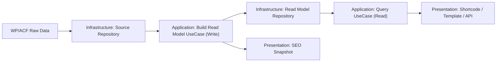
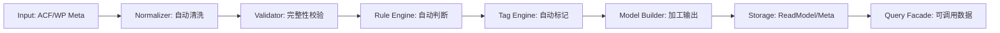

# hg-audit-system V2 设计蓝图（可执行）

版本：V2.0-AB2  
输入依据：`docs/v2-requirements-spec-executable.md`

---

## 1. 蓝图总纲

V2 的核心不是“页面生成”，而是“数据能力工程化”：

1. 把实测数据变成稳定资产（可读、可查、可复用）。
2. 把查询能力变成标准能力（先支持“提款最快 TopN”）。
3. 把展示层变成纯读取（性能稳定，可扩展）。

---

## 2. 架构边界（Clean + CQRS）



### 2.1 Write（写）

触发点：`acf/save_post`  
动作：读取原始字段 -> 规则计算 -> 写入 Read Model + SEO Snapshot -> 失效缓存版本

### 2.2 Read（读）

触发点：前台短码/模板调用  
动作：只读 Read Model / Query Result，禁止临时业务重算

### 2.3 智能大脑流水线（核心）



说明：
1. 每个节点独立可测试。
2. 任一节点失败走降级分支，不影响基础可读输出。
3. 整链路幂等，重复输入不产生冲突结果。

---

## 3. 分层目录蓝图（V2 目标）

```text
src/
  Domain/
    Entity/
      AuditRecord.php
      PlatformAggregate.php
    ValueObject/
      PlatformId.php
      DurationMinutes.php
      CurrencyAmount.php
      RiskLevel.php
      SampleCount.php
    Service/
      RiskRuleEngine.php
      FxLossCalculator.php
      DataNormalizer.php
      DataValidator.php
      TagEngine.php

  Application/
    Contract/
      AuditSourceRepositoryInterface.php
      AuditReadModelRepositoryInterface.php
      RiskConfigRepositoryInterface.php
      ExchangeRateGatewayInterface.php
      CacheStoreInterface.php
    UseCase/
      BuildAuditReadModelUseCase.php
      QueryTopPlatformsUseCase.php
      BuildSeoSnapshotUseCase.php
      ProcessAuditRecordUseCase.php

  Infrastructure/
    Repository/
      WpAuditSourceRepository.php
      WpAuditReadModelRepository.php
      WpRiskConfigRepository.php
    Gateway/
      WpExchangeRateGateway.php
    Cache/
      WpTransientCacheStore.php

  Presentation/
    Shortcode/
      AuditLogController.php
    Query/
      DataQueryFacade.php
    Seo/
      SeoSnapshotRenderer.php
    Api/
      AuditDataRestController.php
      ProcessingDebugController.php
```

注：本期允许“增量落地”，不要求一次性迁移全部旧文件。

---

## 4. 关键数据模型（V2 最小可用）

### 4.1 单条记录读模型（Record Read Model）

建议 meta key：`hg_read_model_v2`

```json
{
  "version": "2.0",
  "audit_post_id": 0,
  "platform_id": 0,
  "audit_score": 1,
  "withdraw": {
    "duration_min": 15.2,
    "duration_text": "15分钟",
    "amount_apply": 1000,
    "amount_received": 995,
    "currency_apply": "USDT",
    "currency_received": "USDT"
  },
  "fx": {
    "loss_pct": 0.01,
    "loss_text": "1.0%"
  },
  "kyc": {
    "status": "sms",
    "level": "light"
  },
  "updated_at": "2026-02-21T00:00:00+08:00"
}
```

### 4.2 平台聚合查询输出（Query DTO）

用于“提款最快 TopN”：

1. `platform_id`
2. `platform_name`
3. `sample_count`
4. `avg_duration_min`
5. `fastest_duration_min`
6. `avg_duration_text`
7. `fastest_duration_text`

---

## 5. 接口契约（第一批）

```php
interface AuditSourceRepositoryInterface {
    public function loadRawByPostId(int $postId): array;
}

interface AuditReadModelRepositoryInterface {
    public function saveRecordModel(int $postId, array $model): void;
    public function findRecordModel(int $postId): ?array;
}

interface QueryDataServiceInterface {
    public function query(array $criteria): array;
}

interface QueryTopPlatformsUseCaseInterface {
    public function byWithdrawSpeed(int $limit, int $minSamples): array;
}

interface DataNormalizerInterface {
    public function normalize(array $raw): array;
}

interface DataValidatorInterface {
    public function validate(array $normalized): array;
}

interface TagEngineInterface {
    public function buildTags(array $normalized, array $decision): array;
}
```

---

## 6. 扩展策略（保证“调得出来”）

### 6.1 查询维度统一入口

统一查询参数 `metric`，首批：

1. `withdraw_speed`（已定义）

后续只新增 UseCase，不改调用方式：

1. `fx_loss`
2. `kyc_strength`
3. `risk_exposure`

### 6.2 调用方式稳定

PHP 调用保持固定：

1. `hg_audit_query_data(['metric' => 'withdraw_speed', 'limit' => 5, 'min_samples' => 1])`
2. `hg_audit_get_top_platforms_by_speed(5, 1)`

---

## 7. 性能与缓存蓝图

1. 查询结果缓存：`12h transient + cache_version`。
2. 请求级缓存：避免同请求重复查询。
3. 写入后统一 bump：`hg_audit_cache_version`。
4. 读路径纪律：前台不做重计算。
5. 智能处理链路预算：单条处理 P95 < 300ms。
6. 可调用查询预算：TopN 查询 P95 < 120ms（命中缓存）。

---

## 8. 兼容与迁移策略

1. 保留现有短码：`[audit_log]`、`[hg_global_audit_table]` 等。
2. 新能力先“旁路接入”，不破坏旧渲染。
3. 老字段读取通过 Infrastructure 做归一化（`get_post_meta`/ACF 差异屏蔽）。
4. 任何字段异常走降级值，禁止 Fatal。

---

## 9. 实施顺序（按风险最小）

### 阶段 A：数据契约固化（先做）

1. 固化查询接口与输出结构。
2. 完成“提款最快 TopN”。

### 阶段 B：写时读模型

1. 在保存链路生成 `hg_read_model_v2`。
2. 前台读模型优先，旧逻辑兜底。
3. 引入“清洗-判断-标记”流水线并记录处理版本。

### 阶段 C：查询维度扩展

1. 增加 `fx_loss` 与 `kyc_strength`。
2. 保持统一查询入口不变。
3. 新增维度仅增加 UseCase，不破坏查询契约。

### 阶段 D：SEO 快照稳定化

1. SEO 输出改为读取快照数据。
2. 确保结构化数据一致可控。

---

## 10. 验收门槛（与需求规格一致）

1. 能稳定查询“提款最快 Top5 平台”。
2. 短码渲染 P95 < 80ms。
3. 前台渲染不依赖重计算。
4. 字段缺失不崩溃、可降级。
5. 现有短码能力不回归。
